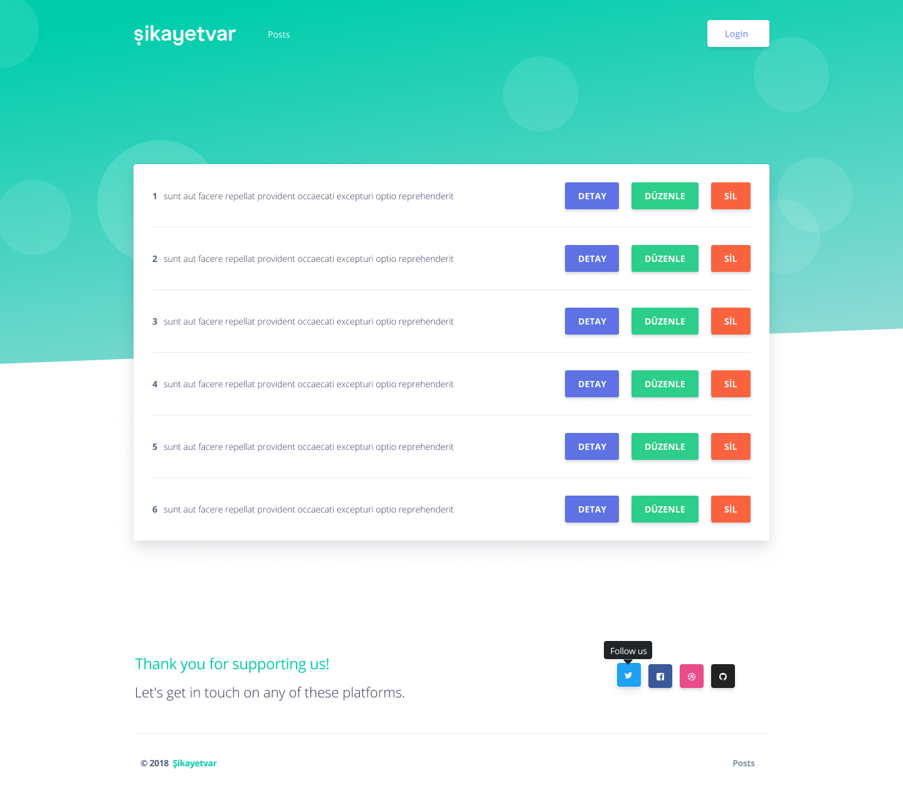
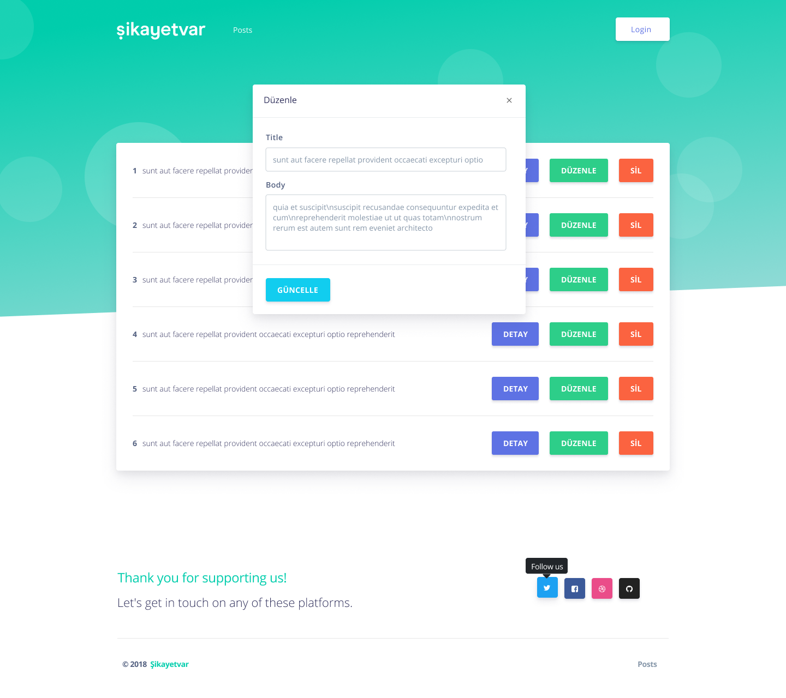
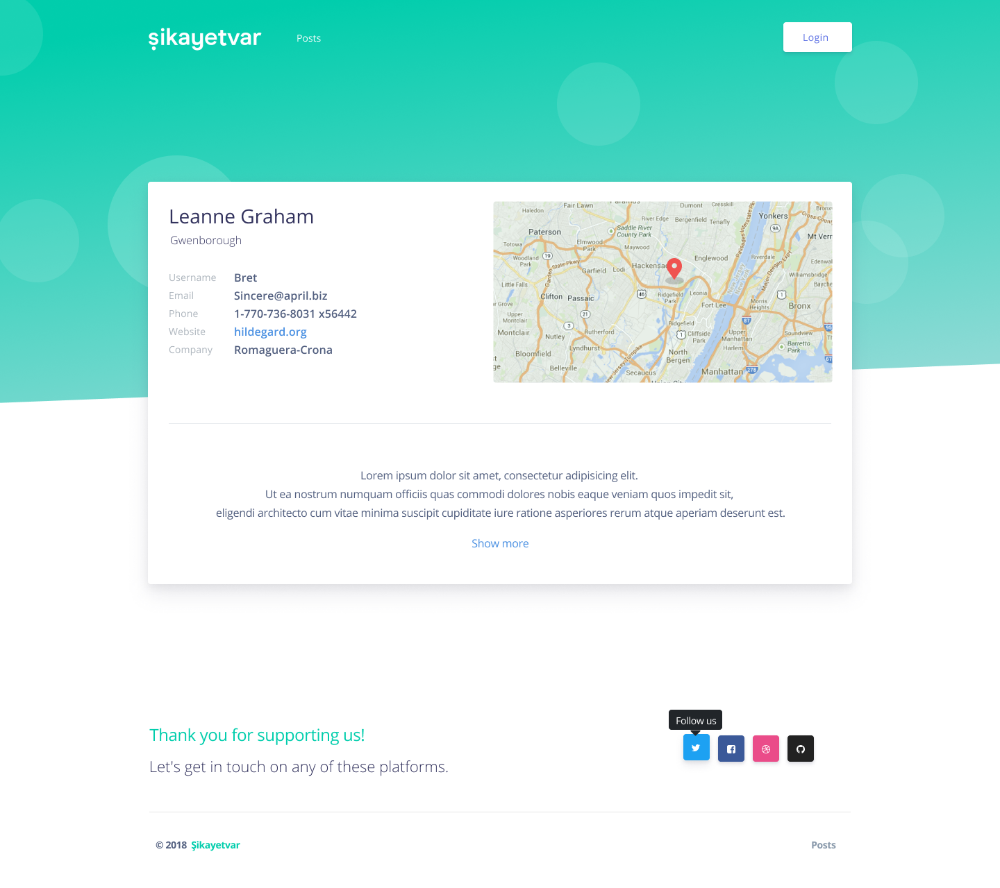

<p align="center">
 
  <a href="#"></a>
   <a href="#"></a>
</p>

<div align="center">



</div>

## Description

<a href='https://crud-todo-app.netlify.app/'>https://crud-todo-app.netlify.app/</a>
This is the project that is build in 5 hours by me.

## Requests of Client

1. Design this application ✅
   https://www.figma.com/file/MMg1IBvUwbfuYiUGXdrG7cHv/odev

2. Use this REST API for CRUD operations ✅
   https://jsonplaceholder.typicode.com

3. List all todos on homepage that url is '/' ✅

4. Add 3 operations each todo item that are Details, Edit and Delete ✅

5. If user click the detail button, he will go to the detail page on '/details/postId' and he will see the all profile details and post detail ✅

### NPM Packages

create-react-app
redux
react-redux

## Setup

### Install

```bash
git clone https://github.com/mucahidyazar/crud-todo-app.git
cd crud-todo-app
npm i or yarn
```

### Production

```bash
npm start or yarn start
```

Go to `localhost:3000` to view the app.

## Contributing

crud-todo-app is an open source project, and contributions of any kind are welcome!

## Author

- [Mucahid Yazar](https://github.com/mucahidyazar)

## License

This project is open source and available under the [MIT License](LICENSE).
